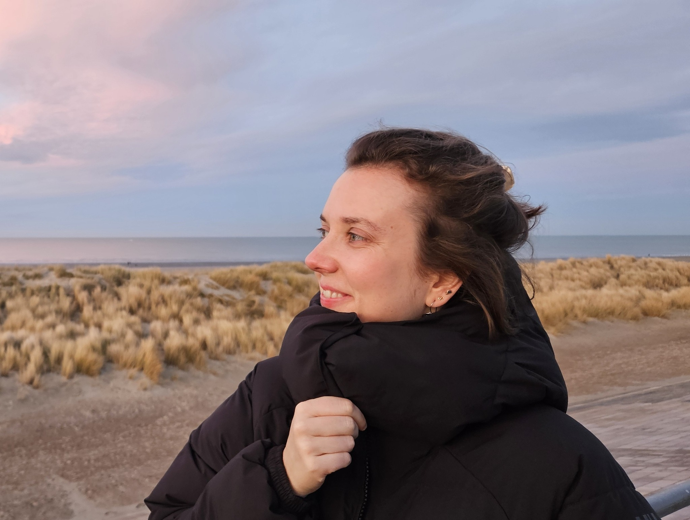
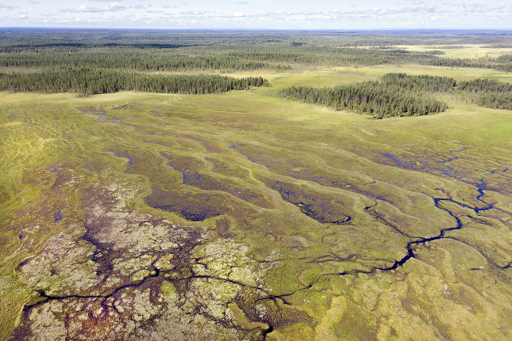

```{=html}
<div class="hero">
  <div class="hero-links-side">
    <a class="hero-pill" href="mailto:clemence.dedinger@univ-reims.fr"><i class="fa-solid fa-envelope"></i> Email</a>
    <a class="hero-pill" href="figs/CV_DEDINGER_2026.pdf"><i class="fa-solid fa-file-pdf"></i> CV (in French)</a>
    <a class="hero-pill" href="https://scholar.google.com/citations?user=8v3FwAsAAAAJ&hl=fr" target="_blank"><i class="fa-solid fa-graduation-cap"></i> Scholar</a>
  </div>

  <div class="hero-main">
    
    <div class="hero-text">
      <h2 class="hero-name">Clémence Dedinger</h2>
      <h2>Postdoctoral Researcher</h2>
      <p class="hero-bio">
        I am a postdoctoral researcher at CRIEG‑REGARDS (University of Reims Champagne‑Ardenne) in <strong>social‑ecological economics</strong>. I lead a research project funded by the Junior Professorship Chair “Economics of Ecological Transition and Bioeconomy” on the <strong>governance of renaturation</strong> in North Karelia (Finland). More broadly, I analyse <strong>socio‑ecological transitions</strong>  with a focus on governance, institutional dynamics and actor practices.
      </p>
    </div>
  </div>
</div>

```
---
```{=html}
<style>
  .full-width-banner {
    width: 100vw;
    position: relative;
    left: 50%;
    right: 50%;
    margin-left: -50vw;
    margin-right: -50vw;
    height: 300px;
    margin-top: 2rem;
    margin-bottom: -60px !important;
}
  .full-width-banner img {
    width: 100%;
    height: 100%;
    object-fit: cover;
    display: block;
  }
</style>

<div class="full-width-banner">
  
  <span class="hero-credit">Makkaralatva-aapa peatland, © T. Mustonen</span>
</div>
```