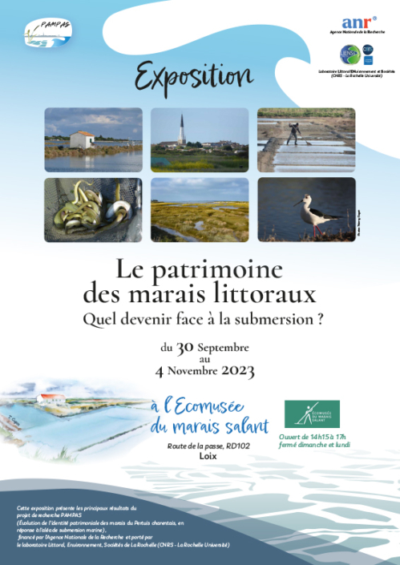
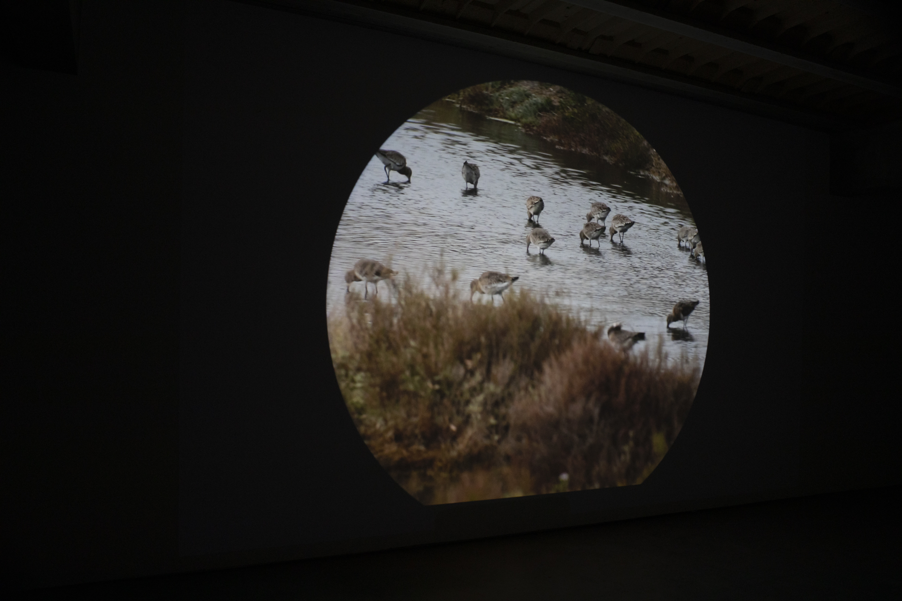
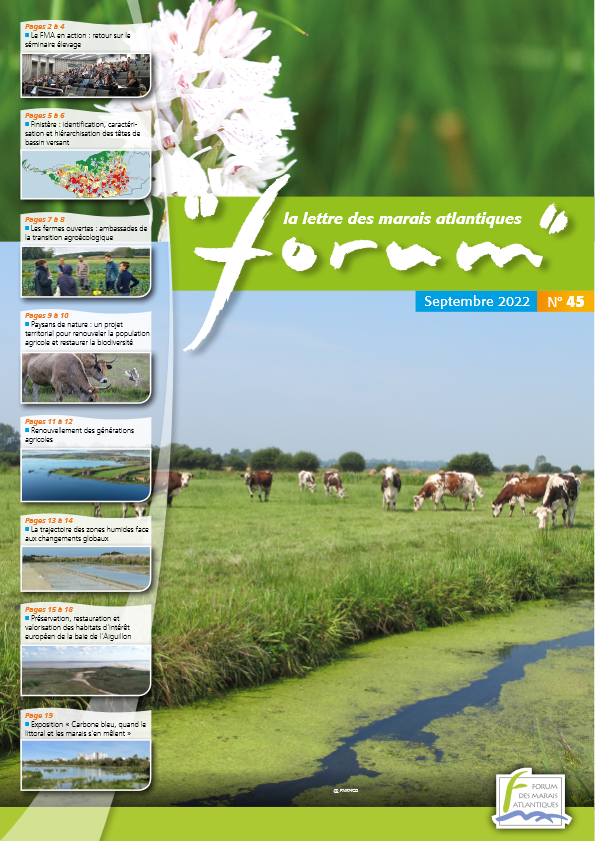

I consider engaging with broader audiences and contributing to public discussions an integral part of my work as a researcher. Beyond academic publications, I develop collaborations across disciplines and participate in exhibitions and projects at the intersection of science, art, and society, exploring alternative ways of producing and sharing knowledge.

---

## Selected initiatives

```{=html}
<div class="society-item">

 <div class="society-image">
  
  </div>

  <div class="society-text">
    <h3>Coastal marsh heritage in the Fier d’Ars</h3>
    <p>
      Public exhibition presenting the results of the ANR PAMPAS project (2019–2023), exploring changes in the heritage identity of the marshes of the Pertuis Charentais in response to marine flooding over the past half-century. Held at the Ecomuseum of Loix-en-Ré (Île de Ré). <br>
      <a href="https://pampas.recherche.univ-lr.fr/portfolio/exposition-pampas-fier-dars/">Read more</a> <br>
    </p>
  </div>
  
</div>
```

---

```{=html}
<div class="society-item">

 <div class="society-image">

<span class="image-credit">© Olivier Crouzel</span>
  </div>

  <div class="society-text">
    <h3>Dikes and People</h3>
    <p>
      Arts and science project combining geography and visual art.
The installation brings together scientific analysis and artistic creation to offer a sensitive understanding of human–nature relationships in coastal marsh landscapes. My own fieldwork interviews were used as source material for the project. <br>
      <a href="https://www.oliviercrouzel.fr/des-digues-et-des-hommes/">Read more</a> <br>
    </p>
  </div>
  
</div>
```

---

```{=html}
<div class="society-item">
  

  <div class="society-text">
    <h3>Newsletter of the Atlantic Marshes</h3>
    <p>
    The <em>Forum des Marais Atlantiques</em> publishes a newsletter that reflects day-to-day initiatives across coastal wetlands. I contributed by sharing my research findings in this publication.
   </p> <br>
      <a class="hero-pill pdf-outline" href="https://forum-zones-humides.org/wp-content/uploads/2022/08/p-6953-1.pdf" target="_blank" rel="noopener" aria-label="Télécharger la thèse (pdf)">
  <i class="fa-solid fa-file-pdf" aria-hidden="true"></i>&nbsp; Download here <span class="pdf-small"></span>
</a>
      <br> </p>
    </p>
  </div>
</div>
```
